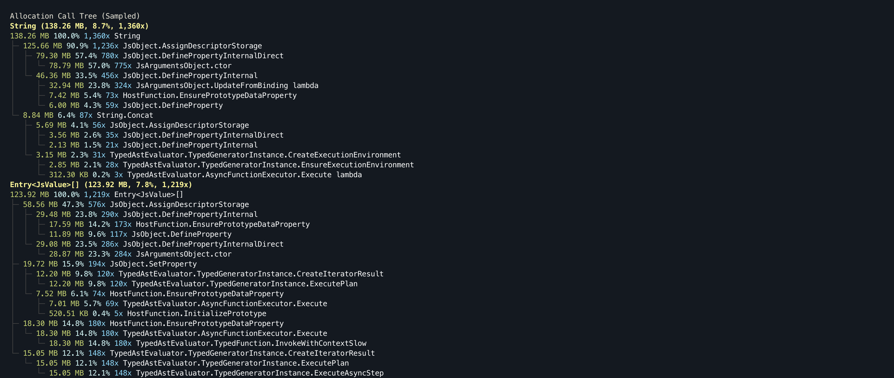

# Asynkron.Profiler

Install globally:

```bash
dotnet tool install -g asynkron-profiler --prerelease
```

A lightweight CLI for CPU, memory allocation, exception, lock contention, and heap profiling of any .NET command using `dotnet-trace` and `dotnet-gcdump`.

This is a profiler frontend/CLI UI built for humans and automation (including AI agents). It outputs plain‑text, structured summaries so the same insights you’d inspect in GUI tools like dotMemory or dotTrace are available to scripts and agent workflows.

## Prerequisites

- .NET SDK 10.x
- `dotnet-trace` and `dotnet-gcdump` installed:

```bash
dotnet tool install -g dotnet-trace
dotnet tool install -g dotnet-gcdump
```

## Profile your own .NET app

Build your app in Release, then point the profiler at the compiled output (fastest and avoids profiling the build itself):

```bash
dotnet build -c Release
asynkron-profiler --cpu -- ./bin/Release/<tfm>/MyApp
```

Framework-dependent apps can be profiled via `dotnet`:

```bash
asynkron-profiler --cpu -- dotnet ./bin/Release/<tfm>/MyApp.dll
```

You can also pass a project or solution file directly. The profiler will build Release and run the resulting executable:

```bash
asynkron-profiler --cpu -- ./MyApp.csproj
asynkron-profiler --cpu -- ./MySolution.sln
```

You can also profile `dotnet run`, but it will mostly capture the dotnet host (and build/restore). Use this only if you can't run the built output directly:

```bash
asynkron-profiler --cpu -- dotnet run -c Release ./MyApp.csproj
```

## Build

```bash
dotnet build -c Release
```

## Pack as a dotnet tool

```bash
dotnet pack -c Release -o ./nupkg src/ProfileTool/ProfileTool.csproj
```

Install from the local package:

```bash
dotnet tool install -g --add-source ./nupkg asynkron-profiler
```

## Usage

### Screenshots

CPU call tree:


Memory allocation call tree:



### Profile a command

CPU profile a command:

```bash
asynkron-profiler --cpu -- ./bin/Release/<tfm>/MyApp
```

Memory allocation profile (GC allocation ticks + call tree):

```bash
asynkron-profiler --memory -- ./bin/Release/<tfm>/MyApp
```

Exception profile:

```bash
asynkron-profiler --exception -- ./bin/Release/<tfm>/MyApp
```

Lock contention profile:

```bash
asynkron-profiler --contention -- ./bin/Release/<tfm>/MyApp
```

Heap snapshot:

```bash
asynkron-profiler --heap -- ./bin/Release/<tfm>/MyApp
```

### Render existing traces

You can render existing files without re-running the app. Supported inputs:

- CPU: `.speedscope.json` or `.nettrace` (will convert to Speedscope)
- Memory: `.nettrace` or `.etlx`
- Exceptions: `.nettrace` or `.etlx`
- Contention: `.nettrace` or `.etlx`
- Heap: `.gcdump` (or a `dotnet-gcdump report` text file)

Examples:

```bash
# Auto-selects CPU/memory/contention/heap based on file extension
asynkron-profiler --input /path/to/trace.nettrace

# Force CPU rendering for a speedscope file
asynkron-profiler --input /path/to/trace.speedscope.json --cpu

# Render memory allocations from an .etlx
asynkron-profiler --input /path/to/trace.etlx --memory

# Render contention from an .etlx
asynkron-profiler --input /path/to/trace.etlx --contention

# Render exceptions from an .etlx
asynkron-profiler --input /path/to/trace.etlx --exception

# Render heap dump
asynkron-profiler --input /path/to/heap.gcdump --heap

# Manual flow: collect a CPU trace, then render it
dotnet-trace collect --output ./profile-output/app.nettrace -- dotnet run MyProject.sln
asynkron-profiler --input ./profile-output/app.nettrace --cpu
```

Outputs are written to `profile-output/` in the current working directory.

## Options

- `--cpu` CPU profile only
- `--memory` memory allocation profile only
- `--exception` exception profile only
- `--contention` lock contention profile only
- `--heap` heap snapshot only
- `--root <text>` root the call tree at the first matching method
- `--calltree-depth <n>` max call tree depth (default: 30)
- `--calltree-width <n>` max children per node (default: 4)
- `--calltree-self` include self-time tree
- `--calltree-sibling-cutoff <n>` hide siblings below X% of the top sibling (default: 5)
- `--filter <text>` filter function tables by substring
- `--exception-type <text>` filter exception tables and call trees by exception type
- `--include-runtime` include runtime/process frames
- `--input <path>` render existing `nettrace`, `speedscope.json`, `etlx`, or `gcdump` files
- `--tfm <tfm>` target framework when profiling a `.csproj` or `.sln`

## Profiler flags

### --cpu
Sampled CPU profiling with a call tree and top‑function table.
Use this to find the hottest methods by time.

Example (examples/cpu):
```bash
dotnet build -c Release examples/cpu/CpuDemo.csproj
asynkron-profiler --cpu -- ./examples/cpu/bin/Release/net10.0/CpuDemo
```

Sample output (top of call tree):
```
Call Tree (Total Time)
327.41 ms 100.0% 1x Total
└─ 299.66 ms 91.5% 1x Program.Main
   └─ 298.22 ms 91.1% 1x Program.RunWork
      └─ 281.02 ms 85.8% 1x Program.CpuWork
         └─ 276.10 ms 84.3% 3x Program.Fib
```

### --memory
Allocation profiling using GC allocation tick events, plus a per‑type call tree.
Use this to find the biggest allocation sources.

Example (examples/memory):
```bash
dotnet build -c Release examples/memory/MemoryDemo.csproj
asynkron-profiler --memory -- ./examples/memory/bin/Release/net10.0/MemoryDemo
```

Sample output (top of call tree):
```
Allocation Call Tree (Sampled)
Byte[] (20.06 MB, 69.4%, 198x)
20.06 MB 100.0% 198x Byte[]
└─ 19.95 MB 99.5% 197x Program.Main lambda
```

### --exception
Exception profiling with thrown counts, throw‑site call tree, and optional catch‑site table/tree.
Use `--exception-type` to focus on a specific exception.

Example (examples/exception):
```bash
dotnet build -c Release examples/exception/ExceptionDemo.csproj
asynkron-profiler --exception --exception-type "InvalidOperation" -- ./examples/exception/bin/Release/net10.0/ExceptionDemo
```

Sample output (top of call tree):
```
Call Tree (Thrown Exceptions)
6,667x 100.0% InvalidOperationException
└─ 6,667x 100.0% Program.Main lambda
   └─ 6,667x 100.0% EH.DispatchEx
```

### --contention
Lock contention profiling with wait‑time call tree and top contended methods.
Use this to find where threads are blocking on locks.

Example (examples/contention):
```bash
dotnet build -c Release examples/contention/ContentionDemo.csproj
asynkron-profiler --contention -- ./examples/contention/bin/Release/net10.0/ContentionDemo
```

Sample output (top of call tree):
```
Call Tree (Wait Time)
49563.89 ms 100.0% 96x Total
└─ 49563.89 ms 100.0% 96x Program.RunWorkers lambda
   └─ 49563.89 ms 100.0% 96x Program.WorkWithLock
```

### --heap
Heap snapshot using `dotnet-gcdump`, with a summary of top types.
Use this to inspect retained memory after the run.

Example (examples/heap):
```bash
dotnet build -c Release examples/heap/HeapDemo.csproj
asynkron-profiler --heap -- ./examples/heap/bin/Release/net8.0/HeapDemo
```

Sample output (top types):
```
HEAP SNAPSHOT: HeapDemo
14,595,494  GC Heap bytes
50,375  GC Heap objects

Object Bytes  Count  Type
  524,312     1    System.Byte[][] (Bytes > 100K)
   30,168     1    System.String (Bytes > 10K)
       24  50,003  System.Byte[]
```

## Troubleshooting

- `dotnet-trace` not found: install with `dotnet tool install -g dotnet-trace` and ensure your global tool path is on `PATH`.
- `dotnet-gcdump` not found: install with `dotnet tool install -g dotnet-gcdump`.
- Empty allocation tables: ensure you ran with `--memory` (GC allocation ticks) or provided a `.nettrace`/`.etlx` that includes GC allocation events.
- Slow or huge traces: reduce the workload/iterations or add filters on your app side, then re-run.
- The CLI checks for required tools on first use and prints install hints when missing.

## Examples

```bash
CPU profiling:
asynkron-profiler --cpu -- ./bin/Release/<tfm>/MyApp
asynkron-profiler --cpu --calltree-depth 5 -- ./bin/Release/<tfm>/MyApp
asynkron-profiler --cpu --input ./profile-output/app.speedscope.json

Memory profiling:
asynkron-profiler --memory -- ./bin/Release/<tfm>/MyApp
asynkron-profiler --memory --root "MyNamespace" -- ./bin/Release/<tfm>/MyApp
asynkron-profiler --memory --input ./profile-output/app.nettrace

Exception profiling:
asynkron-profiler --exception -- ./bin/Release/<tfm>/MyApp
asynkron-profiler --exception --exception-type "InvalidOperation" -- ./bin/Release/<tfm>/MyApp
asynkron-profiler --exception --input ./profile-output/app.nettrace

Contention profiling:
asynkron-profiler --contention -- ./bin/Release/<tfm>/MyApp
asynkron-profiler --contention --calltree-depth 5 -- ./bin/Release/<tfm>/MyApp
asynkron-profiler --contention --input ./profile-output/app.nettrace

Heap snapshot:
asynkron-profiler --heap -- ./bin/Release/<tfm>/MyApp
asynkron-profiler --heap --input ./profile-output/app.gcdump

Render existing traces:
asynkron-profiler --input ./profile-output/app.nettrace
asynkron-profiler --input ./profile-output/app.speedscope.json --cpu
asynkron-profiler --input ./profile-output/app.etlx --memory
asynkron-profiler --input ./profile-output/app.etlx --contention
asynkron-profiler --input ./profile-output/app.etlx --exception

General:
asynkron-profiler --help

asynkron-profiler --cpu --calltree-depth 20 -- ./bin/Release/<tfm>/MyApp
asynkron-profiler --memory --root "MyNamespace" -- ./bin/Release/<tfm>/MyApp
asynkron-profiler --input ./profile-output/app.nettrace --cpu
```
